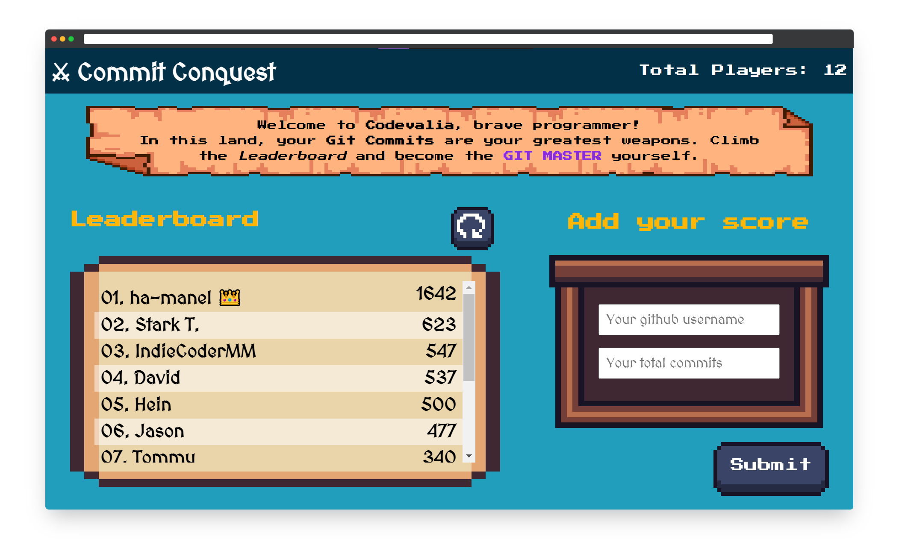

<a name="readme-top"></a>

<div align="center">

  
  <br/>

  <h3><b>Microverse Leaderboard Project</b></h3>

</div>

<!-- TABLE OF CONTENTS -->

# 📗 Table of Contents

- [📗 Table of Contents](#-table-of-contents)
- [📖 Commit Conquest ](#-commit-conquest-)
  - [🛠 Built With ](#-built-with-)
    - [Tech Stack ](#tech-stack-)
    - [Key Features ](#key-features-)
  - [🚀 Live Demo ](#-live-demo-)
  - [💻 Getting Started ](#-getting-started-)
    - [Prerequisites](#prerequisites)
    - [Setup](#setup)
    - [Install](#install)
    - [Usage](#usage)
  - [👨‍🚀 IndieCoderMM ](#-indiecodermm-)
  - [🔭 Future Features ](#-future-features-)
  - [🤝 Contributing ](#-contributing-)
  - [🤩 Show your support ](#-show-your-support-)
  - [🙏 Acknowledgments ](#-acknowledgments-)
  - [💎 Resources ](#-resources-)
  - [📝 License ](#-license-)

<!-- PROJECT DESCRIPTION -->

# 📖 Commit Conquest <a name="about-project"></a>

In **Commit Conquest**, players are challenged to use their _Git Commits_ as points to climb the leaderboard. The game is designed to encourage players to actively contribute to projects, as well as to improve their skills in version control and collaboration. Players can update their progress and compete with other players in real-time.



## 🛠 Built With <a name="built-with"></a>

### Tech Stack <a name="tech-stack"></a>


- [Leaderboard API](https://www.notion.so/Leaderboard-API-service-24c0c3c116974ac49488d4eb0267ade3): To collect and update the scores

<!-- Features -->

### Key Features <a name="key-features"></a>

- **Leaderboard**: Track and view progress in real-time
- **Commit-based Points**: Earn points by making commits
- **Gamification**: Provide fun and engaging way to improve programming skills

<p align="right">(<a href="#readme-top">back to top</a>)</p>

<!-- LIVE DEMO -->

## 🚀 Live Demo <a name="live-demo"></a>

- [Live Demo Link](https://yourdeployedapplicationlink.com)

<p align="right">(<a href="#readme-top">back to top</a>)</p>

<!-- GETTING STARTED -->

## 💻 Getting Started <a name="getting-started"></a>

To get a local copy up and running, follow these steps.

### Prerequisites

In order to run this project you need [Node.js](https://nodejs.org/en/) installed on your computer.

### Setup

Clone this repository to your desired folder:

```sh
  cd my-folder
  git clone git@github.com:IndieCoderMM/commit-conquest.git
```

### Install

Install the dependencies with:

```sh
  npm install
```

### Usage

To run the project, execute the following command:

```sh
  npm start
```

<p align="right">(<a href="#readme-top">back to top</a>)</p>

<!-- AUTHORS -->

## 👨‍🚀 IndieCoderMM <a name="authors"></a>

I am always looking for ways to improve my project. If you have any suggestions or ideas, I would love to hear from you.

[](https://github.com/IndieCoderMM)
[](https://twitter.com/hthant_oo)
[](https://linkedin.com/in/hthantoo)
[](hthant00chk@gmail.com)

<p align="right">(<a href="#readme-top">back to top</a>)</p>

<!-- FUTURE FEATURES -->

## 🔭 Future Features <a name="future-features"></a>

- [x] **Use leaderboard API to track data**
- [x] **Create a stunning UI**
- [x] **Add user interaction**
- [ ] **User registeration**
- [ ] **Social features**
- [ ] **Customizable avatar**
- [ ] **Automatic commit tracking**

<p align="right">(<a href="#readme-top">back to top</a>)</p>

<!-- CONTRIBUTING -->

## 🤝 Contributing <a name="contributing"></a>

I welcome any and all contribution that can help me improve my project. If you have any ideas or feedback that you'd like to share, please don't hesitate to reach out.

<p align="right">(<a href="#readme-top">back to top</a>)</p>

<!-- SUPPORT -->

## 🤩 Show your support <a name="support"></a>

If you like this project, you can support me by giving a ⭐.

<p align="right">(<a href="#readme-top">back to top</a>)</p>

<!-- ACKNOWLEDGEMENTS -->

## 🙏 Acknowledgments <a name="acknowledgements"></a>

I would like to thank all code reviewers for making this project better.

<p align="right">(<a href="#readme-top">back to top</a>)</p>

## 💎 Resources <a name="resources"></a>

- Google fonts
  - [MedievalSharp](https://fonts.google.com/specimen/MedievalSharp)
  - [Press Start 2P](https://fonts.google.com/specimen/Press+Start+2P)
- Assets
  - [GUI Essential](https://crusenho.itch.io/complete-gui-essential-pack)
  - [Pixel Art GUI](https://mounirtohami.itch.io/pixel-art-gui-elements)

<!-- LICENSE -->

## 📝 License <a name="license"></a>

This project is [MIT](./LICENSE.md) licensed.

<p align="right">(<a href="#readme-top">back to top</a>)</p>
